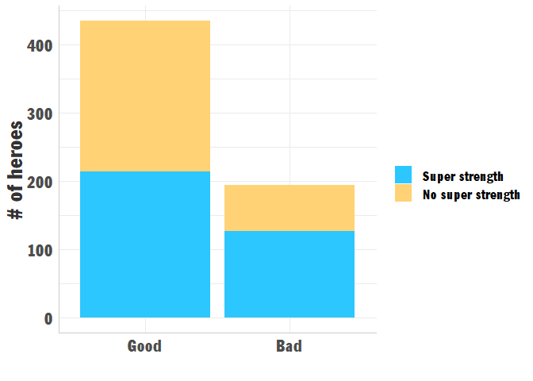
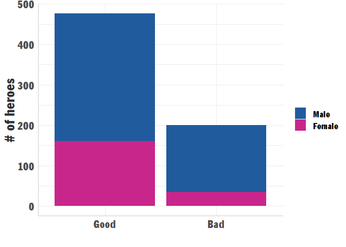

Challenge 1: Exploring the Superheros
================

> **The dataset:** <https://www.kaggle.com/claudiodavi/superhero-set>  
> **Research question:** How are *good* and *evil* superheroes
> different?  
> **Challenge:** Find in the dataset the most interesting quality that
> tends to differentiate *good* and *evil*.

## Import libraries and data

``` r
library(tidyverse)
```

The data was downloaded from Kaggle and the `.csv` files are in the
`/data` folder. Let’s import it:

``` r
# hero characteristics table
heroes <- read_csv("data/heroes_information.csv") %>% 
  filter(Alignment %in% c("good","bad")) %>% 
  mutate(Gender = as_factor(Gender),
         `Eye color` = as_factor(`Eye color`),
         Race = as_factor(Race),
         `Hair color` = as_factor(`Hair color`),
         Publisher = as_factor(Publisher),
         `Skin color` = as_factor(`Skin color`),
         Alignment = as_factor(Alignment))

# hero powers table
powers <- read_csv("data/super_hero_powers.csv")

# join - full profile (some records from 'heroes' lost)
profile <- heroes %>% 
  inner_join(powers, by = c("name" = "hero_names"))
```

## Let’s look at Super Strength

``` r
profile %>% 
  ggplot(aes(x = Alignment, fill = `Super Strength`)) +  ## only look at the 'Super strength' column
  geom_bar() +
  ## styling
  labs(x = "",
       y = "# of heroes",
       fill = "") +
  scale_x_discrete(labels = c("Good","Bad")) +
  scale_fill_manual(values = c("#FFD275", "#2DC7FF"),
                    guide = guide_legend(reverse=TRUE),
                    labels = c("No super strength", "Super strength"))
```

<!-- -->

|      | FALSE | TRUE |
| ---- | ----: | ---: |
| good |   221 |  214 |
| bad  |    67 |  127 |

Looks like villains are more likely to have super strength than heroes.
Let’s try out a Pearson’s Chi-squared test.

``` r
chisq.test(tbl)
```

    ## 
    ##  Pearson's Chi-squared test with Yates' continuity correction
    ## 
    ## data:  tbl
    ## X-squared = 13.657, df = 1, p-value = 0.0002194

The test reveals that with a significance level of 0.05, we can say that
the alignment of the character is not independent from whether they have
super powers or not.

## How about gender?

``` r
heroes <- heroes %>% 
  filter(Gender %in% c("Female","Male")) %>% 
  droplevels()  ## drop unused level "-"

heroes %>%  
  ggplot(aes(x = Alignment, fill = Gender)) +
  geom_bar() +
  ## styling
  labs(x = "",
       y = "# of heroes",
       fill = "") +
  scale_x_discrete(labels = c("Good","Bad")) +
  scale_fill_manual(values = c("#205B9D", "#C9268B"))
```

<!-- -->

|      | FALSE | TRUE |
| ---- | ----: | ---: |
| good |   221 |  214 |
| bad  |    67 |  127 |

Seems like many more villains are males than females.

``` r
chisq.test(tbl)
```

    ## 
    ##  Pearson's Chi-squared test with Yates' continuity correction
    ## 
    ## data:  tbl
    ## X-squared = 17.314, df = 1, p-value = 3.168e-05

The test reveals that with a significance level of 0.05, just like with
super powers, we can say that the alignment of the character is not
independent from their gender. In this case, it seems like more males
are villains than females.
