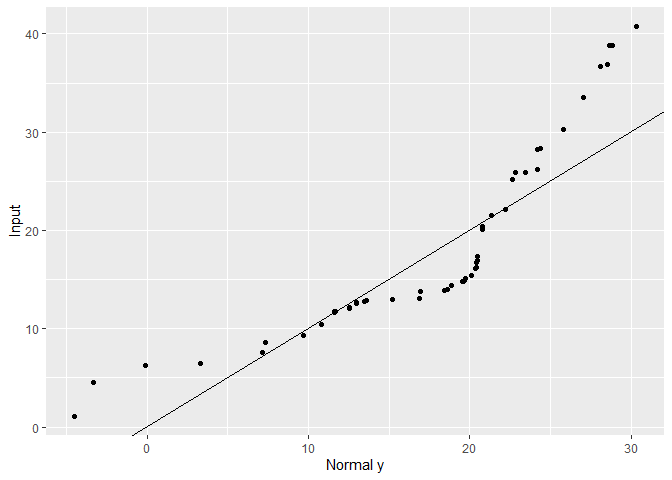
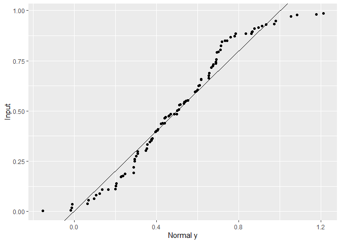

Lab, Part One: Checking Normality
================

## Import libraries

``` r
library(tidyverse)
```

## Defining the function

``` r
qqplot0 <- function(x) {
  # order the input vector
  x <- sort(x)
  
  # make theoretical vector & order it
  # use the length, mean, and sd of the input vector
  theoretical <- rnorm(length(x), mean = mean(x), sd = sd(x)) %>% 
    sort()
  
  # pair the vectors and make a df
  paired <- cbind(x,theoretical) %>% 
    tbl_df()
  
  # make the plot
  paired %>% 
    ggplot(aes(x=theoretical,y=x)) +
    labs(x = "Normal y", y = "Input") +
    geom_point() +
    geom_abline()
}
```

## Testing the function

Test with a normally distributed `x` vector:

``` r
test <-  rnorm(50, mean = 20, sd = 10) 

qqplot0(test)
```

<!-- -->

Test with a random `x` vector:

``` r
test <-  runif(100)

qqplot0(test)
```

<!-- -->
