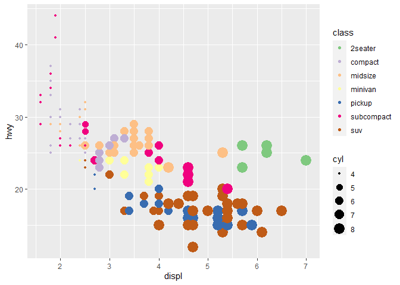
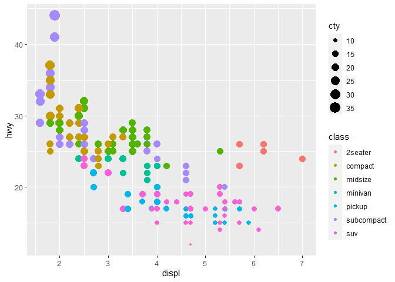
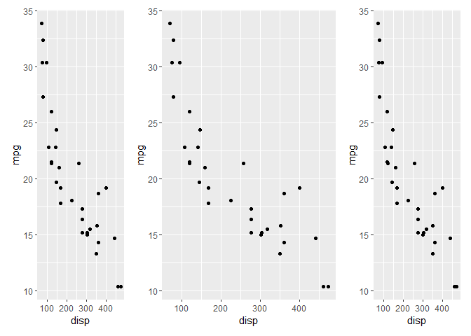
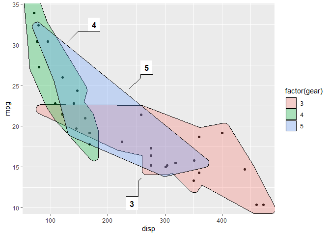

ggplot2 examples and exercises
================

This document contains all the code that is displayed during the
workshop. The document is an RMarkdown document which means that it can
be compiled, along with the code chunks thus executing and capturing the
output of the code within the document. To read more about RMarkdown see
the website for the package, as well as the [Get
Started](https://rmarkdown.rstudio.com/lesson-1.html) guide.

### Exercises

While it is encouraged to follow along in this document as the workshop
progresses and execute the code to see the result, an important part is
also to experiment and play, thus learning how the different settings
affect the output.

The document will contain code chunks with the code examples discussed
during the talk, but it will also contain chunks intended for completing
small exercises. These will use the examples as a starting point and ask
you to modify the code to achieve a given output. Completing these are
optional, but highly recommended, either during or after the workshop.

### Dependencies

This document comes with a list of required packages.

### Datasets

We will use an assortment of datasets throughout the document. The
purpose is mostly to showcase different plots, and less on getting some
divine insight into the world. While not necessary we will call
`data(<dataset>)` before using a new dataset to indicate the
introduction of a new dataset.

## Introduction

We will look at the basic ggplot2 use using the faithful dataset, giving
information on the eruption pattern of the Old Faithful geyser in
Yellowstone National Park.

``` r
data("faithful")
# Basic scatterplot
ggplot(data = faithful, 
       mapping = aes(x = eruptions, y = waiting)) + 
  geom_point()
```

<!-- -->

``` r
# Data and mapping can be given both as global (in ggplot()) or per layer
ggplot() + 
  geom_point(mapping = aes(x = eruptions, y = waiting),
             data = faithful)
```

<!-- -->

If an aesthetic is linked to data it is put into `aes()`

``` r
ggplot(faithful) + 
  geom_point(aes(x = eruptions, y = waiting, colour = eruptions < 3))
```

<!-- -->

If you simple want to set it to a value, put it outside of `aes()`

``` r
ggplot(faithful) + 
  geom_point(aes(x = eruptions, y = waiting),
             colour = 'steelblue')
```

<!-- -->

Some geoms only need a single mapping and will calculate the rest for
you

``` r
ggplot(faithful) + 
  geom_histogram(aes(x = eruptions))
```

    ## `stat_bin()` using `bins = 30`. Pick better value with `binwidth`.

<!-- -->

geoms are drawn in the order they are added. The point layer is thus
drawn on top of the density contours in the example below.

``` r
ggplot(faithful, aes(x = eruptions, y = waiting)) + 
  geom_density_2d() + 
  geom_point()
```

<!-- -->

#### Exercise

Modify the code below to make the points larger squares and slightly
transparent. See `?geom_point` for more information on the point layer.

``` r
ggplot(faithful) + 
  geom_point(aes(x = eruptions, y = waiting), size = 5, alpha = .5)
```

<!-- -->

Hint 1: transparency is controlled with `alpha`, and shape with `shape`
Hint 2: rememberthe difference between mapping and setting aesthetics

-----

Colour the two distributions in the histogram with different colours

``` r
ggplot(faithful) + 
  geom_histogram(aes(x = eruptions, fill = eruptions > 3.2))
```

    ## `stat_bin()` using `bins = 30`. Pick better value with `binwidth`.

<!-- -->

Hint 1: For polygons you can map two different colour-like aesthetics:
`colour` (the colour of the stroke) and `fill` (the fill colour)

-----

Colour the distributions in the histogram by whether `waiting` is above
or below `60`. What happens?

``` r
ggplot(faithful) + 
  geom_histogram(aes(x = eruptions, fill = waiting < 60), position = "identity", alpha = .5)
```

    ## `stat_bin()` using `bins = 30`. Pick better value with `binwidth`.

<!-- -->

``` r
ggplot(faithful) + 
  geom_histogram(aes(x = eruptions, fill = waiting < 60), position = "dodge", alpha = .5)
```

    ## `stat_bin()` using `bins = 30`. Pick better value with `binwidth`.

<!-- -->

Change the plot above by setting `position = 'dodge'` in
`geom_histogram()` (while keeping the colouring by `waiting`). What do
`position` control?

-----

Add a line that separates the two point distributions. See
`?geom_abline` for how to draw straight lines from a slope and
intercept.

``` r
ggplot(faithful) + 
  geom_point(aes(x = eruptions, y = waiting)) +
  geom_abline(slope = -40, intercept = 200)
```

<!-- -->

### Stat

We will use the `mpg` dataset giving information about fuel economy on
different car models.

Every geom has a stat. This is why new data (`count`) can appear when
using `geom_bar()`.

``` r
data("mpg")
ggplot(mpg) + 
  geom_bar(aes(x = class))
```

<!-- -->

The stat can be overwritten. If we have precomputed count we don’t want
any additional computations to perform and we use the `identity` stat to
leave the data alone

``` r
library(dplyr)
```

    ## 
    ## Attaching package: 'dplyr'

    ## The following objects are masked from 'package:stats':
    ## 
    ##     filter, lag

    ## The following objects are masked from 'package:base':
    ## 
    ##     intersect, setdiff, setequal, union

``` r
mpg_counted <- mpg %>% 
  count(class, name = 'count')
ggplot(mpg_counted) + 
  geom_bar(aes(x = class, y = count), stat = 'identity')
```

<!-- -->

Most obvious geom+stat combinations have a dedicated geom constructor.
The one above is available directly as `geom_col()`

``` r
ggplot(mpg_counted) + 
  geom_col(aes(x = class, y = count))
```

<!-- -->

Values calculated by the stat is available with the `after_stat()`
function inside `aes()`. You can do all sorts of computations inside
that.

``` r
ggplot(mpg) + 
  geom_bar(aes(x = class, y = after_stat(100 * count / sum(count))))
```

<!-- -->

Many stats provide multiple variations of the same calculation, and
provides a default (here, `density`)

``` r
ggplot(mpg) + 
  geom_density(aes(x = hwy))
```

<!-- -->

While the others must be used with the `after_stat()` function

``` r
ggplot(mpg) + 
  geom_density(aes(x = hwy, y = after_stat(scaled)))
```

<!-- -->

#### Exercises

While most people use `geom_*()` when adding layers, it is just as valid
to add a `stat_*()` with an attached geom. Look at `geom_bar()` and
figure out which stat it uses as default. Then modify the code to use
the stat directly instead (i.e. adding `stat_*()` instead of
`geom_bar()`)

``` r
ggplot(mpg) + 
  geom_bar(aes(x = class))
```

<!-- -->

``` r
ggplot(mpg) +
  stat_count(aes(x = class))
```

<!-- -->

-----

Use `stat_summary()` to add a red dot at the mean `hwy` for each group

``` r
ggplot(mpg) + 
  geom_jitter(aes(x = class, y = hwy), width = 0.2) +
  stat_summary(aes(x = class, y = hwy), fun = mean, color = "red", size = 2) +
  stat_summary(aes(x = class, y = hwy), fun = median, color = "blue", size = 2)
```

    ## Warning: Removed 7 rows containing missing values (geom_segment).
    
    ## Warning: Removed 7 rows containing missing values (geom_segment).

<!-- -->

Hint: You will need to change the default geom of `stat_summary()`

### Scales

Scales define how the mapping you specify inside `aes()` should happen.
All mappings have an associated scale even if not specified.

``` r
ggplot(mpg) + 
  geom_point(aes(x = displ, y = hwy, colour = class))
```

<!-- -->

take control by adding one explicitly. All scales follow the same naming
conventions.

``` r
ggplot(mpg) + 
  geom_point(aes(x = displ, y = hwy, colour = class)) + 
  scale_colour_brewer(type = 'qual', name = "CLASS")
```

<!-- -->

Positional mappings (x and y) also have associated scales.

``` r
ggplot(mpg) + 
  geom_point(aes(x = displ, y = hwy)) + 
  scale_x_continuous(breaks = c(3, 5, 6)) + 
  scale_y_continuous(trans = 'log10')
```

<!-- -->

#### Exercises

Use `RColorBrewer::display.brewer.all()` to see all the different
palettes from Color Brewer and pick your favourite. Modify the code
below to use it

``` r
ggplot(mpg) + 
  geom_point(aes(x = displ, y = hwy, colour = class)) + 
  scale_colour_brewer(type = 'qual') ## so that colorbrewer chooses a qualitative palette
```

<!-- -->

-----

Modify the code below to create a bubble chart (scatterplot with size
mapped to a continuous variable) showing `cyl` with size. Make sure that
only the present amount of cylinders (4, 5, 6, and 8) are present in the
legend.

``` r
ggplot(mpg) + 
  geom_point(aes(x = displ, y = hwy, colour = class, size = cyl)) + 
  scale_colour_brewer(type = 'qual')
```

<!-- -->

``` r
ggplot(mpg) + 
  geom_point(aes(x = displ, y = hwy, colour = class, size = cyl)) + 
  scale_colour_brewer(type = 'qual') +
  scale_size_area(breaks = c(4,5,6,8))  ## more natural sizes
```

<!-- -->

``` r
ggplot(mpg) + 
  geom_point(aes(x = displ, y = hwy, colour = class, size = cyl)) + 
  scale_colour_brewer(type = 'qual') +
  scale_size_area(breaks = c(4,5,6,8), max_size = 10)  ## more natural sizes
```

<!-- -->

Hint: The `breaks` argument in the scale is used to control which values
are present in the legend.

Explore the different types of size scales available in ggplot2. Is the
default the most appropriate here?

-----

Modify the code below so that colour is no longer mapped to the discrete
`class` variable, but to the continuous `cty` variable. What happens to
the guide?

``` r
ggplot(mpg) + 
  geom_point(aes(x = displ, y = hwy, colour = class, size = cty))
```

<!-- -->

-----

The type of guide can be controlled with the `guide` argument in the
scale, or with the `guides()` function. Continuous colours have a
gradient colour bar by default, but setting it to `legend` will turn it
back to the standard look. What happens when multiple aesthetics are
mapped to the same variable and uses the guide type?

``` r
ggplot(mpg) + 
  geom_point(aes(x = displ, y = hwy, colour = cty, size = cty)) +
  # bubble guide is a legend guide
  # color guide is called a colorbar
  guides(color = 'legend')
```

<!-- -->

### Facets

The facet defines how data is split among panels. The default facet
(`facet_null()`) puts all the data in a single panel, while
`facet_wrap()` and `facet_grid()` allows you to specify different types
of small multiples

``` r
ggplot(mpg) + 
  geom_point(aes(x = displ, y = hwy)) + 
  facet_wrap(~ class)
```

<!-- -->

``` r
ggplot(mpg) + 
  geom_point(aes(x = displ, y = hwy)) + 
  facet_grid(year ~ drv)
```

<!-- -->

#### Exercises

One of the great things about facets is that they share the axes between
the different panels. Sometimes this is undiserable though, and the
behaviour can be changed with the `scales` argument. Experiment with the
different possible settings in the plot below:

``` r
ggplot(mpg) + 
  geom_point(aes(x = displ, y = hwy)) + 
  facet_wrap(~ drv)
```

<!-- -->

``` r
ggplot(mpg) + 
  geom_point(aes(x = displ, y = hwy)) + 
  facet_wrap(~ drv, scales = "free")
```

<!-- -->

``` r
ggplot(mpg) + 
  geom_point(aes(x = displ, y = hwy)) + 
  facet_wrap(~ drv, scales = "free_y")
```

<!-- -->

-----

Usually the space occupied by each panel is equal. This can create
problems when different scales are used. Modify the code below so that
the y scale differs between the panels in the plot. What happens?

``` r
ggplot(mpg) + 
  geom_bar(aes(y = manufacturer)) + 
  facet_grid(class ~ .)
```

<!-- -->

``` r
ggplot(mpg) + 
  geom_bar(aes(y = manufacturer)) + 
  facet_grid(class ~ ., scales = "free_y")
```

<!-- -->

``` r
ggplot(mpg) + 
  geom_bar(aes(y = manufacturer)) + 
  facet_grid(class ~ ., space = "free_y", scales = "free_y")
```

<!-- -->

Use the `space` argument in `facet_grid()` to change the plot above so
each bar has the same width again.

-----

Facets can be based on multiple variables by adding them together. Try
to recreate the same panels present in the plot below by using
`facet_wrap()`

``` r
ggplot(mpg) + 
  geom_point(aes(x = displ, y = hwy)) + 
  facet_grid(year ~ drv)
```

<!-- -->

``` r
ggplot(mpg) + 
  geom_point(aes(x = displ, y = hwy)) + 
  facet_wrap(~ drv + year)
```

<!-- -->

### Coordinates

The coordinate system is the fabric you draw your layers on in the end.
The default \`coord\_cartesion provides the standard rectangular x-y
coordinate system. Changing the coordinate system can have dramatic
effects

``` r
ggplot(mpg) + 
  geom_bar(aes(x = class)) + 
  coord_polar()
```

<!-- -->

``` r
ggplot(mpg) + 
  geom_bar(aes(x = class))
```

<!-- -->

``` r
ggplot(mpg) + 
  geom_bar(aes(x = class)) + 
  coord_polar(theta = 'y') + 
  expand_limits(y = 70)
```

<!-- -->

You can zoom both on the scale…

``` r
ggplot(mpg) + 
  geom_bar(aes(x = class)) + 
  scale_y_continuous(limits = c(0, 40))
```

    ## Warning: Removed 3 rows containing missing values (geom_bar).

<!-- -->

and in the coord. You usually want the latter as it avoids changing the
plottet data

``` r
ggplot(mpg) + 
  geom_bar(aes(x = class)) + 
  coord_cartesian(ylim = c(0, 40))
```

<!-- -->

#### Exercises

In the same way as limits can be set in both the positional scale and
the coord, so can transformations, using `coord_trans()`. Modify the
code below to apply a log transformation to the y axis; first using
`scale_y_continuous()`, and then using `coord_trans()`. Compare the
results — how do they differ?

``` r
ggplot(mpg) + 
  geom_point(aes(x = hwy, y = displ)) +
  scale_y_continuous(trans = "log")
```

<!-- -->

``` r
ggplot(mpg) + 
  geom_point(aes(x = hwy, y = displ)) +
  coord_trans(y = "log")
```

<!-- -->

-----

Coordinate systems are particularly important in cartography. While we
will not spend a lot of time with it in this workshop, spatial plotting
is well supported in ggplot2 with `geom_sf()` and `coord_sf()` (which
interfaces with the sf package). The code below produces a world map.
Try changing the `crs` argument in `coord_sf()` to be `'+proj=robin'`
(This means using the Robinson projection).

``` r
# Get the borders of all countries
world <- sf::st_as_sf(maps::map('world', plot = FALSE, fill = TRUE))
world <- sf::st_wrap_dateline(world, 
                              options = c("WRAPDATELINE=YES", "DATELINEOFFSET=180"),
                              quiet = TRUE)
```

    ## Warning in CPL_wrap_dateline(st_geometry(x), options, quiet): GDAL Error 1:
    ## IllegalArgumentException: Points of LinearRing do not form a closed linestring
    
    ## Warning in CPL_wrap_dateline(st_geometry(x), options, quiet): GDAL Error 1:
    ## IllegalArgumentException: Points of LinearRing do not form a closed linestring

``` r
# Plot code
ggplot(world) + 
  geom_sf() + 
  coord_sf(crs = "+proj=moll")
```

<!-- -->

Maps are a huge area in data visualisation and simply too big to cover
in this workshop. If you want to explore further I advice you to explore
the [r-spatial wbsite](https://www.r-spatial.org) as well as the website
for the [sf package](https://r-spatial.github.io/sf)

### Theme

Theming defines the feel and look of your final visualisation and is
something you will normally defer to the final polishing of the plot. It
is very easy to change looks with a prebuild theme

``` r
ggplot(mpg) + 
  geom_bar(aes(y = class)) + 
  facet_wrap(~year) + 
  theme_minimal()
```

<!-- -->

Further adjustments can be done in the end to get exactly the look you
want

``` r
ggplot(mpg) + 
  geom_bar(aes(y = class)) + 
  facet_wrap(~year) + 
  labs(title = "Number of car models per class",
       caption = "source: http://fueleconomy.gov",
       x = NULL,
       y = NULL) +
  scale_x_continuous(expand = c(0, NA)) + 
  theme_minimal() + 
  theme(
    text = element_text('Avenir Next Condensed'),
    strip.text = element_text(face = 'bold', hjust = 0),
    plot.caption = element_text(face = 'italic'),
    panel.grid.major = element_line('white', size = 0.5),
    panel.grid.minor = element_blank(),
    panel.grid.major.y = element_blank(),
    panel.ontop = TRUE
  )
```

    ## Warning in grid.Call(C_stringMetric, as.graphicsAnnot(x$label)): font family not
    ## found in Windows font database

    ## Warning in grid.Call(C_textBounds, as.graphicsAnnot(x$label), x$x, x$y, : font
    ## family not found in Windows font database
    
    ## Warning in grid.Call(C_textBounds, as.graphicsAnnot(x$label), x$x, x$y, : font
    ## family not found in Windows font database

    ## Warning in grid.Call(C_stringMetric, as.graphicsAnnot(x$label)): font family not
    ## found in Windows font database

    ## Warning in grid.Call(C_textBounds, as.graphicsAnnot(x$label), x$x, x$y, : font
    ## family not found in Windows font database
    
    ## Warning in grid.Call(C_textBounds, as.graphicsAnnot(x$label), x$x, x$y, : font
    ## family not found in Windows font database
    
    ## Warning in grid.Call(C_textBounds, as.graphicsAnnot(x$label), x$x, x$y, : font
    ## family not found in Windows font database

    ## Warning in grid.Call.graphics(C_text, as.graphicsAnnot(x$label), x$x, x$y, :
    ## font family not found in Windows font database

    ## Warning in grid.Call(C_textBounds, as.graphicsAnnot(x$label), x$x, x$y, : font
    ## family not found in Windows font database
    
    ## Warning in grid.Call(C_textBounds, as.graphicsAnnot(x$label), x$x, x$y, : font
    ## family not found in Windows font database
    
    ## Warning in grid.Call(C_textBounds, as.graphicsAnnot(x$label), x$x, x$y, : font
    ## family not found in Windows font database

<!-- -->

#### Exercises

Themes can be overwhelming, especially as you often try to optimise for
beauty while you learn. To remove the last part of the equation, the
exercise is to take the plot given below and make it as hideous as
possible using the theme function. Go absolutely crazy, but take note of
the effect as you change different settings.

``` r
ggplot(mpg) + 
  geom_bar(aes(y = class, fill = drv)) + 
  facet_wrap(~year) + 
  labs(title = "Number of car models per class",
       caption = "source: http://fueleconomy.gov",
       x = 'Number of cars',
       y = NULL)
```

<!-- -->

## Extensions

While ggplot2 comes with a lot of batteries included, the extension
ecosystem provides priceless additinal features

### Plot composition

We start by creating 3 separate plots

``` r
p1 <- ggplot(msleep) + 
  geom_boxplot(aes(x = sleep_total, y = vore, fill = vore))
p1
```

<!-- -->

``` r
p2 <- ggplot(msleep) + 
  geom_bar(aes(y = vore, fill = vore))
p2
```

<!-- -->

``` r
p3 <- ggplot(msleep) + 
  geom_point(aes(x = bodywt, y = sleep_total, colour = vore)) + 
  scale_x_log10()
p3
```

<!-- -->

Combining them with patchwork is a breeze using the different operators

``` r
library(patchwork)
p1 + p2 + p3
```

<!-- -->

``` r
(p1 | p2) / 
   p3
```

<!-- -->

``` r
p_all <- (p1 | p2) / 
            p3
p_all + plot_layout(guides = 'collect')
```

<!-- -->

``` r
p_all & theme(legend.position = 'none')
```

<!-- -->

``` r
p_all <- p_all & theme(legend.position = 'none')
p_all + plot_annotation(
  title = 'Mammalian sleep patterns',
  tag_levels = 'A'
)
```

<!-- -->

#### Excercises

Patchwork will assign the same amount of space to each plot by default,
but this can be controlled with the `widths` and `heights` argument in
`plot_layout()`. This can take a numeric vector giving their relative
sizes (e.g. `c(2, 1)` will make the first plot twice as big as the
second). Modify the code below so that the middle plot takes up half of
the total space:

``` r
p <- ggplot(mtcars) + 
  geom_point(aes(x = disp, y = mpg))
p + p + p
```

<!-- -->

``` r
p + p + p + plot_layout(widths = c(1,2,1))
```

<!-- -->

``` r
p + p + p + plot_layout(widths = unit(c(8,1,1), c('cm', 'null', 'null')))
```

<!-- -->

-----

The `&` operator can be used with any type of ggplot2 object, not just
themes. Modify the code below so the two plots share the same y-axis
(same limits)

``` r
p1 <- ggplot(mtcars[mtcars$gear == 3,]) + 
  geom_point(aes(x = disp, y = mpg))
p2 <- ggplot(mtcars[mtcars$gear == 4,]) + 
  geom_point(aes(x = disp, y = mpg))
p1 + p2
```

<!-- -->

``` r
p1 + p2 & scale_y_continuous(limits = c(10,40))
```

<!-- -->

-----

Patchwork contains many features for fine tuning the layout and
annotation. Very complex layouts can be obtained by providing a design
specification to the `design` argument in `plot_layout()`. The design
can be defined as a textual representation of the cells. Use the layout
given below. How should the textual representation be undertood.

``` r
p1 <- ggplot(mtcars) + 
  geom_point(aes(x = disp, y = mpg))
p2 <- ggplot(mtcars) + 
  geom_bar(aes(x = factor(gear)))
p3 <- ggplot(mtcars) + 
  geom_boxplot(aes(x = factor(gear), y = mpg))
layout <- '
AA#
#BB
C##
'
p1 + p2 + p3 + plot_layout(design = layout)
```

<!-- -->

### Animation

ggplot2 is usually focused on static plots, but gganimate extends the
API and grammar to describe animations. As such it feels like a very
natural extension of using ggplot2

``` r
ggplot(economics) + 
  geom_line(aes(x = date, y = unemploy))
```

<!-- -->

``` r
library(gganimate)
ggplot(economics) + 
  geom_line(aes(x = date, y = unemploy)) + 
  transition_reveal(along = date)
```

<!-- -->

There are many different transitions that control how data is
interpreted for animation, as well as a range of other animation
specific features

``` r
ggplot(mpg) + 
  geom_bar(aes(x = factor(cyl)))
```

<!-- -->

``` r
ggplot(mpg) + 
  geom_bar(aes(x = factor(cyl))) + 
  labs(title = 'Number of cars in {closest_state} by number of cylinders') + 
  transition_states(states = year) + 
  enter_grow() + 
  exit_fade()
```

<!-- -->

#### Exercises

The animation below will animate between points showing cars with
different cylinders.

``` r
ggplot(mpg) + 
  geom_point(aes(x = displ, y = hwy)) + 
  ggtitle("Cars with {closest_state} cylinders") + 
  transition_states(factor(cyl))

ggplot(mpg) + 
  geom_point(aes(x = displ, y = hwy, group = seq_len(nrow(mpg)))) + 
  ggtitle("Cars with {closest_state} cylinders") + 
  transition_states(factor(cyl))
```

<!-- -->

gganimate uses the `group` aesthetic to match observations between
states. By default the group aesthetic is set to the same value, so
observations are matched by their position (first row of 4 cyl is
matched to first row of 5 cyl etc.). This is clearly wrong here (why?).
Add a mapping to the `group` aesthetic to ensure that points do not move
between the different states.

-----

In the presence of discrete aesthetic mappings (`colour` below), the
group is deduced if not given. The default behaviour of objects that
appear and disappear during the animation is to simply pop in and out of
existance. `enter_*()` and `exit_*()` functions can be used to control
this behaviour. Experiment with the different enter and exit functions
provided by gganimate below. What happens if you add multiple enter or
exit functions to the same animation?

``` r
ggplot(mpg) + 
  geom_point(aes(x = displ, y = hwy, colour = factor(cyl))) + 
  ggtitle("Cars with {closest_state} cylinders") + 
  transition_states(factor(cyl))
```

<!-- -->

-----

In the animation below (as in all the other animations) the changes
happens at constant speed. How values change during an animation is
called easing and can be controlled using the `ease_aes()` function.
Read the documentation for `ease_aes()` and experiment with different
easings in the animation.

``` r
mpg2 <- tidyr::pivot_longer(mpg, c(cty,hwy))
ggplot(mpg2) + 
  geom_point(aes(x = displ, y = value)) + 
  ggtitle("{if (closest_state == 'cty') 'Efficiency in city' else 'Efficiency on highway'}") + 
  transition_states(name)

mpg2 <- tidyr::pivot_longer(mpg, c(cty,hwy))
ggplot(mpg2) + 
  geom_point(aes(x = displ, y = value)) + 
  ggtitle("{if (closest_state == 'cty') 'Efficiency in city' else 'Efficiency on highway'}") + 
  transition_states(name) +
  ease_aes(y = "cubic-in-out")
```

<!-- -->

### Annotation

Text is a huge part of storytelling with your visualisation.
Historically, textual annotations has not been the best part of ggplot2
but new extensions make up for that.

Standard geom\_text will often result in overlaping labels

``` r
ggplot(mtcars, aes(x = disp, y = mpg)) + 
  geom_point() + 
  geom_text(aes(label = row.names(mtcars)))
```

<!-- -->

ggrepel takes care of that

``` r
library(ggrepel)
ggplot(mtcars, aes(x = disp, y = mpg)) + 
  geom_point() + 
  geom_text_repel(aes(label = row.names(mtcars)))
```

<!-- -->

If you want to highlight certain parts of your data and describe it, the
`geom_mark_*()` family of geoms have your back

``` r
library(ggforce)
ggplot(mtcars, aes(x = disp, y = mpg)) +
  geom_point() + 
  geom_mark_ellipse(aes(filter = gear == 4,
                        label = '4 gear cars',
                        description = 'Cars with fewer gears tend to both have higher yield and lower displacement'))
```

<!-- -->

``` r
ggplot(mtcars, aes(x = disp, y = mpg)) +
  geom_point() + 
  geom_mark_rect(aes(filter = gear == 4,
                        label = '4 gear cars',
                        description = 'Cars with fewer gears tend to both have higher yield and lower displacement'))
```

<!-- -->

``` r
ggplot(mtcars, aes(x = disp, y = mpg)) +
  geom_point() + 
  geom_mark_rect(aes(filter = gear == 4,
                        label = '4 gear cars',
                        description = 'Cars with fewer gears tend to both have higher yield and lower displacement'),radius = 0)
```

<!-- -->

``` r
ggplot(mtcars, aes(x = disp, y = mpg)) +
  geom_point() + 
  geom_mark_circle(aes(filter = gear == 4,
                        label = '4 gear cars',
                        description = 'Cars with fewer gears tend to both have higher yield and lower displacement'),radius = 0)
```

<!-- -->

``` r
ggplot(mtcars, aes(x = disp, y = mpg)) +
  geom_point() + 
  geom_mark_circle(aes(filter = gear == 4,
                        label = '4 gear cars',
                        description = 'Cars with fewer gears tend to both have higher yield and lower displacement')) +
  coord_cartesian(clip = "off")
```

<!-- -->

``` r
ggplot(mtcars, aes(x = disp, y = mpg)) +
  geom_point() + 
  geom_mark_hull(aes(filter = gear == 4,
                        label = '4 gear cars',
                        description = 'Cars with fewer gears tend to both have higher yield and lower displacement'), concavity = 10)
```

<!-- -->

``` r
ggplot(mtcars, aes(x = disp, y = mpg)) +
  geom_point() + 
  geom_mark_hull(aes(fill = factor(gear), label = gear))
```

<!-- -->

#### Exercises

ggrepel has a tonne of settings for controlling how text labels move.
Often, though, the most effective is simply to not label everything.
There are two strategies for that: Either only use a subset of the data
for the repel layer, or setting the label to `""` for those you don’t
want to plot. Try both in the plot below where you only label 10 random
points.

``` r
mtcars2 <- mtcars
mtcars2$label <- rownames(mtcars2)
points_to_label <- sample(nrow(mtcars), 10)
mtcars2$label[-points_to_label] <- ""
ggplot(mtcars2, aes(x = disp, y = mpg)) + 
  geom_point() + 
  geom_text_repel(aes(label = label), data = mtcars2[points_to_label,])
```

<!-- -->

``` r
ggplot(mtcars2, aes(x = disp, y = mpg)) + 
  geom_point() + 
  geom_text_repel(aes(label = label))
```

<!-- -->

-----

Explore the documentation for `geom_text_repel`. Find a way to ensure
that the labels in the plot below only repels in the vertical direction

``` r
mtcars2$label <- ""
mtcars2$label[1:10] <- rownames(mtcars2)[1:10]
ggplot(mtcars2, aes(x = disp, y = mpg)) + 
  geom_point() + 
  geom_text_repel(aes(label = label))
```

<!-- -->

``` r
mtcars2$label <- ""
mtcars2$label[1:10] <- rownames(mtcars2)[1:10]
ggplot(mtcars2, aes(x = disp, y = mpg)) + 
  geom_point() + 
  geom_text_repel(aes(label = label), direction = 'y')
```

<!-- -->

-----

ggforce comes with 4 different types of mark geoms. Try them all out in
the code below:

``` r
ggplot(mtcars, aes(x = disp, y = mpg)) +
  geom_point() + 
  geom_mark_ellipse(aes(filter = gear == 4,
                        label = '4 gear cars'))
```

<!-- -->

### Networks

ggplot2 has been focused on tabular data. Network data in any shape and
form is handled by ggraph

``` r
library(ggraph)
library(tidygraph)
```

    ## 
    ## Attaching package: 'tidygraph'

    ## The following object is masked from 'package:stats':
    ## 
    ##     filter

``` r
graph <- create_notable('zachary') %>% 
  mutate(clique = as.factor(group_infomap()))
ggraph(graph) + 
  geom_mark_hull(aes(x, y, fill = clique)) +  ## colored by group using ggforce 
  geom_edge_link() +  ## the lines that connect the points
  geom_node_point(size = 2)  ## the points
```

    ## Using `stress` as default layout

<!-- -->

dendrograms are just a specific type of network

``` r
iris_clust <- hclust(dist(iris[, 1:4]))
ggraph(iris_clust) + 
  geom_edge_bend() + 
  geom_node_point(aes(filter = leaf))
```

    ## Using `dendrogram` as default layout

<!-- -->

#### Exercies

Most network plots are defined by a layout algorithm, which takes the
network structure and calculate a position for each node. The layout
algorithm is global and set in the `ggraph()`. The default `auto` layout
will inspect the network object and try to choose a sensible layout for
it (e.g. dendrogram for a hierarchical clustering as above). There is,
however no optimal layout and it is often a good idea to try out
different layouts. Try out different layouts in the graph below. See the
[the website](https://ggraph.data-imaginist.com/reference/index.html)
for an overview of the different layouts.

``` r
ggraph(graph) + 
  geom_edge_link() + 
  geom_node_point(aes(colour = clique), size = 3)
```

    ## Using `stress` as default layout

<!-- -->

-----

There are many different ways to draw edges. Try to use
`geom_edge_parallel()` in the graph below to show the presence of
multiple edges

``` r
highschool_gr <- as_tbl_graph(highschool)
ggraph(highschool_gr) + 
  geom_edge_link() + 
  geom_node_point()
```

    ## Using `stress` as default layout

<!-- -->

Faceting works in ggraph as it does in ggplot2, but you must choose to
facet by either nodes or edges. Modify the graph below to facet the
edges by the `year` variable (using `facet_edges()`)

``` r
ggraph(highschool_gr) + 
  geom_edge_fan() + 
  geom_node_point()
```

    ## Using `stress` as default layout

<!-- -->

### Looks

Many people have already desgned beautiful (and horrible) themes for
you. Use them as a base

``` r
p <- ggplot(mtcars, aes(mpg, wt)) +
  geom_point(aes(color = factor(carb))) +
  labs(
    x = 'Fuel efficiency (mpg)', 
    y = 'Weight (tons)',
    title = 'Seminal ggplot2 example',
    subtitle = 'A plot to show off different themes',
    caption = 'Source: It’s mtcars — everyone uses it'
  )
library(hrbrthemes)
p + 
  scale_colour_ipsum() + 
  theme_ipsum()
```

<!-- -->

``` r
library(ggthemes)
p + 
  scale_colour_excel() + 
  theme_excel()
```

<!-- -->

## Drawing anything

``` r
states <- c(
  'eaten', "eaten but said you didn\'t", 'cat took it', 'for tonight',
  'will decompose slowly'
)
pie <- data.frame(
  state = factor(states, levels = states),
  amount = c(4, 3, 1, 1.5, 6),
  stringsAsFactors = FALSE
)
ggplot(pie) + 
  geom_col(aes(x = 0, y = amount, fill = state))
```

<!-- -->

``` r
ggplot(pie) + 
  geom_col(aes(x = 0, y = amount, fill = state)) + 
  coord_polar(theta = 'y')
```

<!-- -->

``` r
ggplot(pie) + 
  geom_col(aes(x = 0, y = amount, fill = state)) + 
  coord_polar(theta = 'y') + 
  scale_fill_tableau(name = NULL,
                     guide = guide_legend(ncol = 2)) + 
  theme_void() + 
  theme(legend.position = 'top', 
        legend.justification = 'left')
```

<!-- -->

``` r
ggplot(pie) + 
  geom_arc_bar(aes(x0 = 0, y0 = 0, r0 = 0, r = 1, amount = amount, fill = state), stat = 'pie') + 
  coord_fixed()
```

<!-- -->

``` r
ggplot(pie) + 
  geom_arc_bar(aes(x0 = 0, y0 = 0, r0 = 0, r = 1, amount = amount, fill = state), stat = 'pie') + 
  coord_fixed() + 
  scale_fill_tableau(name = NULL,
                     guide = guide_legend(ncol = 2)) + 
  theme_void() + 
  theme(legend.position = 'top', 
        legend.justification = 'left')
```

<!-- -->

``` r
ggplot(mpg) + 
  # geom_bar(aes(x = hwy), stat = 'bin')
  geom_histogram(aes(x = hwy))
```

    ## `stat_bin()` using `bins = 30`. Pick better value with `binwidth`.

<!-- -->

``` r
ggplot(mpg) + 
  geom_bar(aes(x = hwy)) + 
  scale_x_binned(n.breaks = 30, guide = guide_axis(n.dodge = 2))
```

<!-- -->
